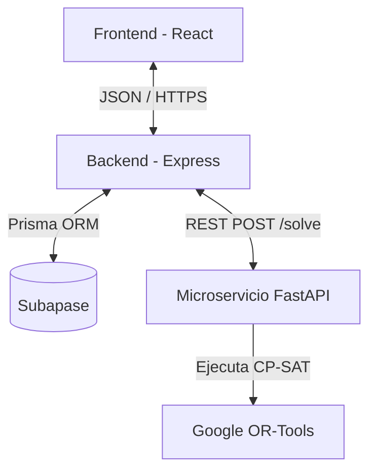

<div align="center">

# 📅 SGOHA
**Sistema de Generación Óptima de Horarios Académicos**

*Plataforma inteligente de optimización combinatoria para la planificación académica en entornos de currículo flexible, impulsada por IA y Spec-Driven Development.*


---
</div>

## 📑 Tabla de Contenidos
1. [📌 Descripción y Alcance](#-descripción-y-alcance)
2. [🛠 Stack Tecnológico](#-stack-tecnológico)
3. [🧠 Motor de Optimización (CSP)](#-motor-de-optimización-csp)
4. [🏗 Arquitectura del Sistema](#-arquitectura-del-sistema)
5. [🔌 API REST y Contratos](#-api-rest-y-contratos)
6. [⚙️ Instalación y Despliegue](#️-instalación-y-despliegue)
7. [📚 Documentación Académica (Rúbrica)](#-documentación-académica-rúbrica)
8. [👥 Equipo de Desarrollo](#-equipo-de-desarrollo)

---

## 📌 Descripción y Alcance

**SGOHA** resuelve el complejo problema de crear horarios universitarios de manera manual. Debido a la multiplicidad de variables (aulas físicas, disponibilidad de docentes, límites de créditos por alumno y prerrequisitos), el cálculo manual es ineficiente y propenso a colisiones.

Nuestra solución lo automatiza usando **Constraint Programming (Programación con Restricciones)**, garantizando matemáticamente cero solapamientos.

### Alcance Funcional
| Módulo | Funcionalidad |
|---|---|
| **Gestión (CRUD)** | Administración segura de Estudiantes, Docentes, Cursos y Aulas. |
| **Autenticación** | Seguridad JWT y validación basada en Roles (RBAC). |
| **Generación CSP** | Creación del horario institucional y docente en < 30 segundos. |
| **Control Académico** | Bloqueo de matrículas por prerrequisitos o exceso de créditos (20-22). |
| **Dashboard y Grillas** | Visualización interactiva con validación Drag & Drop en tiempo real. |
| **Exportación** | Descarga de horarios consolidados en PDF y Excel. |

---

## 🛠 Stack Tecnológico

Elegimos una arquitectura desacoplada orientada a microservicios para dividir la carga transaccional de la carga computacional pesada.

| Capa | Tecnología | Propósito Técnico |
|---|---|---|
| **Frontend** | React 18 + Vite | SPA ultrarrápida, ruteo con TanStack, UI con Shadcn/ui. |
| **Backend Core** | Node.js + Express | API transaccional, middleware JWT y validación Zod. |
| **Motor CSP** | FastAPI (Python 3.11)| Microservicio de alto rendimiento dedicado a OR-Tools. |
| **Base de Datos** |Supabase| Persistencia relacional, seguridad RLS. |
| **ORM** | Prisma 5 | Tipado estricto de base de datos a TypeScript. |
| **Contenedores** | Docker | Orquestación aislada de entornos. |

---

## 🧠 Motor de Optimización (CSP)

El corazón de SGOHA es el solver basado en **Google OR-Tools**. El problema está modelado con variables booleanas multidimensionales `x[curso, docente, aula, franja]`.

### Variables del Modelo
```text
┌──────────────────────────────────────────────────────────┐
│                   ESPACIO DE BÚSQUEDA                    │
├──────────────┬───────────────────────────────────────────┤
│  C (Cursos)  │ Oferta académica del semestre activo      │
│  D (Docentes)│ Plantilla con disponibilidad limitada     │
│  E (Alumnos) │ Matriculados con historial y prerrequisitos│
│  A (Aulas)   │ Infraestructura física con aforo máximo   │
│  H (Franjas) │ Slots de tiempo semanales (L-S)           │
└──────────────┴───────────────────────────────────────────┘
```

### Restricciones Críticas (Hard Constraints)
1. **Unicidad Espacio-Temporal:** Un aula o un docente no pueden tener dos clases al mismo tiempo.
2. **Capacidad:** Los alumnos inscritos no pueden superar el aforo del aula física.
3. **Disponibilidad:** El docente solo es asignado dentro de sus horas declaradas.
4. **Reglas Académicas:** Carga mínima de 20 y máxima de 22 créditos por estudiante.

---

## 🏗 Arquitectura del Sistema



---

## 🔌 API REST y Contratos

La comunicación entre el Backend y el Microservicio CSP se realiza a través de un contrato estricto validado por Pydantic.

**Endpoint Principal:** `POST /api/schedules/generate`

```json
// Ejemplo de Solicitud (SolveRequest)
{
  "period_id": "2026-I",
  "timeout_seconds": 30,
  "courses": [
    {
      "id": "MAT101",
      "teacher_ids": ["T001", "T002"],
      "classroom_ids": ["A101"]
    }
  ]
}
```

---

## ⚙️ Instalación y Despliegue

### Requisitos Previos
* Node.js v20+
* Python 3.11+
* Docker & Docker Compose

### Levantar Todo con Docker (Recomendado)
```bash
# 1. Clonar y configurar variables
git clone https://github.com/BryamsVL/TALLER-DE-PROYECTOS-2---202610.git
cd TALLER-DE-PROYECTOS-2---202610
cp .env.example .env

# 2. Orquestar contenedores
docker-compose up --build
```

### Accesos Locales
* **Frontend:** `http://localhost:5173`
* **API Backend:** `http://localhost:3001`
* **Documentación CSP (Swagger):** `http://localhost:8000/docs`

---

## 📚 Documentación Académica (Rúbrica)

> Cada criterio de evaluación está mapeado directamente al artefacto que lo evidencia.

---

### 📋 3.1 — Planificación del Proyecto (Jira)

| Artefacto requerido | Documento |
|---|---|
| **Backlog del producto** — HU formuladas, priorización por valor/riesgo/complejidad, relación con CSP | [📄 backlog-producto.md](docs/planificacion/backlog-producto.md) |
| **Estructuración del trabajo** — Épicas, releases y sprints con objetivos claros | [📄 planificacion-jira.md](docs/planificacion/planificacion-jira.md) |
| **Gestión temporal** — Cronograma, dependencias y ruta crítica | [📄 cronograma.md](docs/planificacion/cronograma.md) |
| **Métricas ágiles** — Tablas de Burndown, Burnup, Velocidad y Control por sprint | [📄 metricas-agiles.md](docs/planificacion/metricas-agiles.md) |
| **Análisis de métricas** — Evolución del proyecto, cuellos de botella, estabilidad del equipo | [📄 analisis-metricas.md](docs/planificacion/analisis-metricas.md) |

**Artefactos de Sprint:**
| Sprint | Backlog | Retrospectiva | Informe |
|---|---|---|---|
| Sprint 1 ✅ | [backlog.md](docs/sprints/sprint-1/backlog.md) | [retrospectiva.md](docs/sprints/sprint-1/retrospectiva.md) | [project-charter.md](docs/sprints/sprint-1/project-charter.md) |
| Sprint 2 🔄 | [backlog.md](docs/sprints/sprint-2/backlog.md) | [retrospectiva.md](docs/sprints/sprint-2/retrospectiva.md) | [informe-estado.md](docs/sprints/sprint-2/informe-estado.md) |
| Sprint 3 ⬜ | [backlog.md](docs/sprints/sprint-3/backlog.md) | — | [planificacion.md](docs/sprints/sprint-3/planificacion.md) |

---

### 💰 3.2 — Presupuesto del Proyecto

| Artefacto requerido | Documento |
|---|---|
| **Fuente de costos** — RRHH, infraestructura tecnológica, costos indirectos | [📄 costos-fuentes.md](docs/gestion/costos-fuentes.md) |
| **Resumen presupuestal** — Tabla completa del proyecto | [📄 presupuesto.md](docs/gestion/presupuesto.md) |
| **Costos a lo largo del tiempo** | [📄 costos-tiempo.md](docs/gestion/costos-tiempo.md) |
| **Costos por Sprint** | [📄 costos-por-sprint.md](docs/gestion/costos-por-sprint.md) |
| **Costo acumulado del proyecto** | [📄 costo-acumulado.md](docs/gestion/costo-acumulado.md) |
| **Análisis** — Complejidad vs. costo, drivers de incremento, Green Software | [📄 analisis-sostenibilidad.md](docs/gestion/analisis-sostenibilidad.md) |

---

### ⚠️ 3.3 — Gestión de Riesgos y Oportunidades

| Artefacto requerido | Documento |
|---|---|
| **Registro de riesgos** — Descripción, probabilidad × impacto, estrategia de mitigación | [📄 registro-riesgos.md](docs/gestion/registro-riesgos.md) |
| **Registro de oportunidades** — Impacto positivo y estrategia de aprovechamiento | [📄 registro-oportunidades.md](docs/gestion/registro-oportunidades.md) |
| **Análisis** — Relación riesgos ↔ CSP, limitaciones técnicas y dependencias externas | [📄 analisis-riesgos.md](docs/gestion/analisis-riesgos.md) |

---

### 🧠 3.4 — Spec-Driven Development (SDD)

| Artefacto requerido | Documento |
|---|---|
| **AGENTS.md** — Principios del sistema, reglas globales, restricciones duras y blandas | [📄 AGENTS.md](docs/sdd/AGENTS.md) |
| **constitution.md** — Complemento de principios y restricciones del sistema | [📄 constitution.md](docs/sdd/constitution.md) |
| **Spec.md** — Especificación formal: Entradas, Salidas, Reglas de negocio, Casos límite | [📄 spec.md](docs/sdd/spec.md) |
| **Análisis de coherencia** — Spec ↔ modelo CSP ↔ implementación, anticipación de conflictos | [📄 analisis-sdd.md](docs/sdd/analisis-sdd.md) |
| **Decisiones técnicas** — Trade-offs, justificación de arquitectura | [📄 decisiones-tecnicas.md](docs/sdd/decisiones-tecnicas.md) |

---

### 🗂️ 3.5 — Gestión del Repositorio en GitHub

| Artefacto requerido | Evidencia |
|---|---|
| **Estrategia de ramas** (Git Flow) | Ver rama `main` / `develop` / `feature/*` en historial Git |
| **Commits semánticos** | Ver [historial de commits](https://github.com/BryamsVL/TALLER-DE-PROYECTOS-2---202610/commits/main) |
| **Pull Requests con revisión** | Ver [Pull Requests](https://github.com/BryamsVL/TALLER-DE-PROYECTOS-2---202610/pulls) |
| **Desarrollo incremental** | Backlogs de sprint en tabla de arriba (§ 3.1) |
| **README.md completo** — Descripción, instalación y arquitectura | Este mismo archivo |
| **Matriz de trazabilidad** — RF → HU → commit (tabla RWD completa) | [📄 trazabilidad.md](docs/planificacion/trazabilidad.md) |
| **Integración de funcionalidades y evolución del sistema** — Por sprint y capa | [📄 evolucion-sistema.md](docs/planificacion/evolucion-sistema.md) |
| **Documentación de arquitectura** (ARC42) | [📄 ARC42.md](docs/arquitectura/ARC42.md) |
| **Motor CSP con OR-Tools** | [📄 Algoritmo CSP con OR TOOLS](docs/arquitectura/Algoritmo%20CSP%20con%20OR%20TOOLS.md) |
| **Guía de pruebas del backend** | [📄 Guía de Testing](docs/arquitectura/Gu%C3%ADa%20de%20Pruebas%20(Testing)%20-%20Backend%20SGOHA.md) |
| **Análisis de trazabilidad** — Backlog ↔ commits ↔ funcionalidades + colaboración real | [📄 analisis-trazabilidad.md](docs/planificacion/analisis-trazabilidad.md) |


---

## 👥 Equipo de Desarrollo

| Rol | Integrante | Responsabilidad Clave |
|---|---|---|
| **Product Owner** | Edward Flores Rodriguez | Validación funcional y Backlog. |
| **Scrum Master** | Andre De La Torre Segura | Remoción de impedimentos, métricas. |
| **Dev CSP/Backend** | Alberto Patiño Reynoso | Algoritmo OR-Tools y matemáticas complejas. |
| **Dev Backend/Auth**| Brianna Cortez Ponce| Middlewares, Express, Seguridad. |
| **Dev Frontend/UI** | Bryams Vilchez Lazaro | SPA React, interfaces drag & drop. |
| **Dev QA/DevOps** | Jack Perez Lizarbe | CI/CD, automatización Docker, reportes. |

<div align="center">
  <br>
  <b>Desarrollado bajo licencia MIT</b><br>
  <sub>Taller de Proyectos 2 — Universidad Continental — Huancayo, Perú — 2026</sub>
</div>
