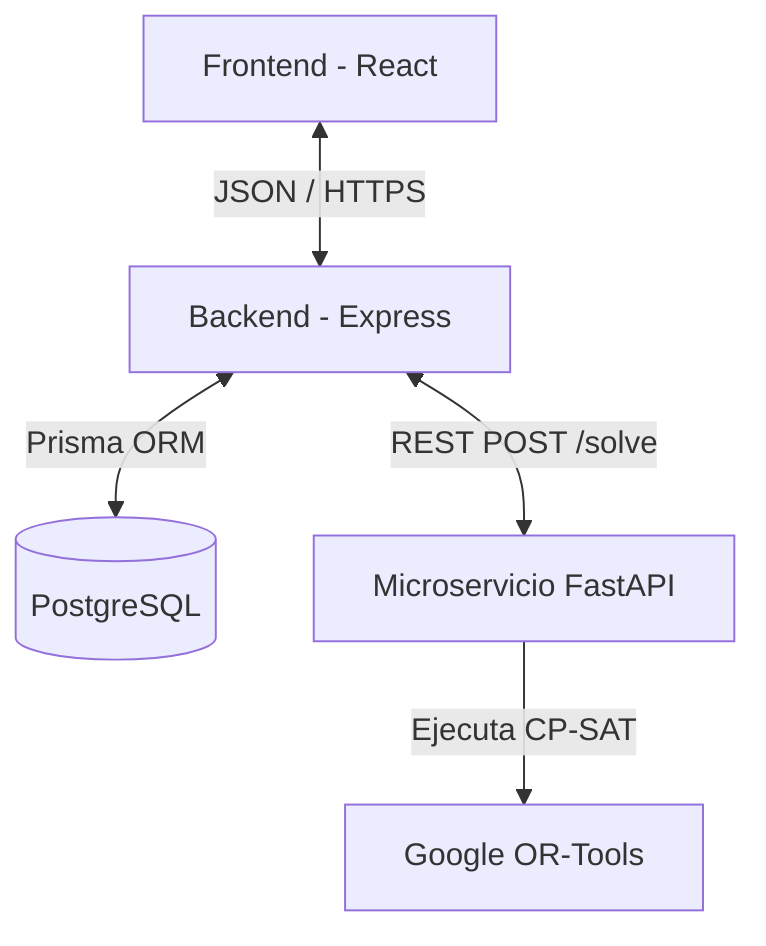

<div align="center">

# 📅 SGOHA
**Sistema de Generación Óptima de Horarios Académicos**

*Plataforma inteligente de optimización combinatoria para la planificación académica en entornos de currículo flexible, impulsada por IA y Spec-Driven Development.*


---
</div>

## 📑 Tabla de Contenidos
1. [📌 Descripción y Alcance](#-descripción-y-alcance)
2. [🛠 Stack Tecnológico](#-stack-tecnológico)
3. [🧠 Motor de Optimización (CSP)](#-motor-de-optimización-csp)
4. [🏗 Arquitectura del Sistema](#-arquitectura-del-sistema)
5. [🔌 API REST y Contratos](#-api-rest-y-contratos)
6. [⚙️ Instalación y Despliegue](#️-instalación-y-despliegue)
7. [📚 Documentación Académica (Rúbrica)](#-documentación-académica-rúbrica)
8. [👥 Equipo de Desarrollo](#-equipo-de-desarrollo)

---

## 📌 Descripción y Alcance

**SGOHA** resuelve el complejo problema de crear horarios universitarios de manera manual. Debido a la multiplicidad de variables (aulas físicas, disponibilidad de docentes, límites de créditos por alumno y prerrequisitos), el cálculo manual es ineficiente y propenso a colisiones.

Nuestra solución lo automatiza usando **Constraint Programming (Programación con Restricciones)**, garantizando matemáticamente cero solapamientos.

### Alcance Funcional
| Módulo | Funcionalidad |
|---|---|
| **Gestión (CRUD)** | Administración segura de Estudiantes, Docentes, Cursos y Aulas. |
| **Autenticación** | Seguridad JWT y validación basada en Roles (RBAC). |
| **Generación CSP** | Creación del horario institucional y docente en < 30 segundos. |
| **Control Académico** | Bloqueo de matrículas por prerrequisitos o exceso de créditos (20-22). |
| **Dashboard y Grillas** | Visualización interactiva con validación Drag & Drop en tiempo real. |
| **Exportación** | Descarga de horarios consolidados en PDF y Excel. |

---

## 🛠 Stack Tecnológico

Elegimos una arquitectura desacoplada orientada a microservicios para dividir la carga transaccional de la carga computacional pesada.

| Capa | Tecnología | Propósito Técnico |
|---|---|---|
| **Frontend** | React 18 + Vite | SPA ultrarrápida, ruteo con TanStack, UI con Shadcn/ui. |
| **Backend Core** | Node.js + Express | API transaccional, middleware JWT y validación Zod. |
| **Motor CSP** | FastAPI (Python 3.11)| Microservicio de alto rendimiento dedicado a OR-Tools. |
| **Base de Datos** | PostgreSQL (Supabase)| Persistencia relacional, seguridad RLS. |
| **ORM** | Prisma 5 | Tipado estricto de base de datos a TypeScript. |
| **Contenedores** | Docker | Orquestación aislada de entornos. |

---

## 🧠 Motor de Optimización (CSP)

El corazón de SGOHA es el solver basado en **Google OR-Tools**. El problema está modelado con variables booleanas multidimensionales `x[curso, docente, aula, franja]`.

### Variables del Modelo
```text
┌──────────────────────────────────────────────────────────┐
│                   ESPACIO DE BÚSQUEDA                    │
├──────────────┬───────────────────────────────────────────┤
│  C (Cursos)  │ Oferta académica del semestre activo      │
│  D (Docentes)│ Plantilla con disponibilidad limitada     │
│  E (Alumnos) │ Matriculados con historial y prerrequisitos│
│  A (Aulas)   │ Infraestructura física con aforo máximo   │
│  H (Franjas) │ Slots de tiempo semanales (L-S)           │
└──────────────┴───────────────────────────────────────────┘
```

### Restricciones Críticas (Hard Constraints)
1. **Unicidad Espacio-Temporal:** Un aula o un docente no pueden tener dos clases al mismo tiempo.
2. **Capacidad:** Los alumnos inscritos no pueden superar el aforo del aula física.
3. **Disponibilidad:** El docente solo es asignado dentro de sus horas declaradas.
4. **Reglas Académicas:** Carga mínima de 20 y máxima de 22 créditos por estudiante.

---

## 🏗 Arquitectura del Sistema



---

## 🔌 API REST y Contratos

La comunicación entre el Backend y el Microservicio CSP se realiza a través de un contrato estricto validado por Pydantic.

**Endpoint Principal:** `POST /api/schedules/generate`

```json
// Ejemplo de Solicitud (SolveRequest)
{
  "period_id": "2026-I",
  "timeout_seconds": 30,
  "courses": [
    {
      "id": "MAT101",
      "teacher_ids": ["T001", "T002"],
      "classroom_ids": ["A101"]
    }
  ]
}
```

---

## ⚙️ Instalación y Despliegue

### Requisitos Previos
* Node.js v20+
* Python 3.11+
* Docker & Docker Compose

### Levantar Todo con Docker (Recomendado)
```bash
# 1. Clonar y configurar variables
git clone https://github.com/BryamsVL/TALLER-DE-PROYECTOS-2---202610.git
cd TALLER-DE-PROYECTOS-2---202610
cp .env.example .env

# 2. Orquestar contenedores
docker-compose up --build
```

### Accesos Locales
* **Frontend:** `http://localhost:5173`
* **API Backend:** `http://localhost:3001`
* **Documentación CSP (Swagger):** `http://localhost:8000/docs`

---

## 📚 Documentación Académica (Rúbrica)

Toda la documentación está estructurada bajo metodologías ágiles y **Spec-Driven Development**, cumpliendo rigurosamente los entregables del curso.

### 3.1. Planificación del Proyecto (Jira)
* 📋 **[Backlog del Producto](docs/planificacion/backlog-producto.md)**
* 🏗️ **[Estructuración y Ruta Crítica](docs/planificacion/planificacion-jira.md)**
* 📊 **[Métricas Ágiles (Burnup, Burndown, Velocidad)](docs/planificacion/metricas-agiles.md)**

### 3.2. Presupuesto del Proyecto
* 💰 **[Fuentes de Costos (RRHH e Infraestructura)](docs/gestion/costos-fuentes.md)**
* 📈 **[Evolución de Costos en el Tiempo](docs/gestion/costos-tiempo.md)**
* 🔄 **[Costos Desglosados por Sprint](docs/gestion/costos-por-sprint.md)**
* 📈 **[Costo Acumulado (Curva S)](docs/gestion/costo-acumulado.md)**
* 🍃 **[Análisis de Complejidad y Green Software](docs/gestion/analisis-sostenibilidad.md)**

### 3.3. Gestión de Riesgos y Oportunidades
* ⚠️ **[Matriz de Riesgos y Oportunidades](docs/gestion/riesgos-oportunidades.md)**

### 3.4. Spec-Driven Development (SDD)
* 🤖 **[Principios del Sistema (Constitution)](docs/sdd/AGENTS.md)**
* 📄 **[Especificación Formal (Restricciones y Casos)](docs/sdd/spec.md)**
* 🔎 **[Análisis SDD (Coherencia y Ambigüedad)](docs/sdd/analisis-sdd.md)**

### 3.5. Gestión del Repositorio en GitHub
* 🔗 **[Matriz de Trazabilidad Total](docs/planificacion/trazabilidad.md)**
* 🟢 **[Sprint 1: Base de Entidades y Auth](docs/sprints/sprint-1/backlog.md)**
* 🟡 **[Sprint 2: Motor de Optimización CSP](docs/sprints/sprint-2/backlog.md)**
* ⚪ **[Sprint 3: PMV Final y Grillas](docs/sprints/sprint-3/backlog.md)**

---

## 👥 Equipo de Desarrollo

| Rol | Integrante | Responsabilidad Clave |
|---|---|---|
| **Product Owner** | Brianna Cortez Ponce | Validación funcional y Backlog. |
| **Scrum Master** | Andre De La Torre Segura | Remoción de impedimentos, métricas. |
| **Dev CSP/Backend** | Alberto Patiño Reynoso | Algoritmo OR-Tools y matemáticas complejas. |
| **Dev Backend/Auth**| Edward Flores Rodriguez| Middlewares, Express, Seguridad. |
| **Dev Frontend/UI** | Bryams Vilchez Lazaro | SPA React, interfaces drag & drop. |
| **Dev QA/DevOps** | Jack Perez Lizarbe | CI/CD, automatización Docker, reportes. |

<div align="center">
  <br>
  <b>Desarrollado bajo licencia MIT</b><br>
  <sub>Taller de Proyectos 2 — Universidad Continental — Huancayo, Perú — 2026</sub>
</div>
