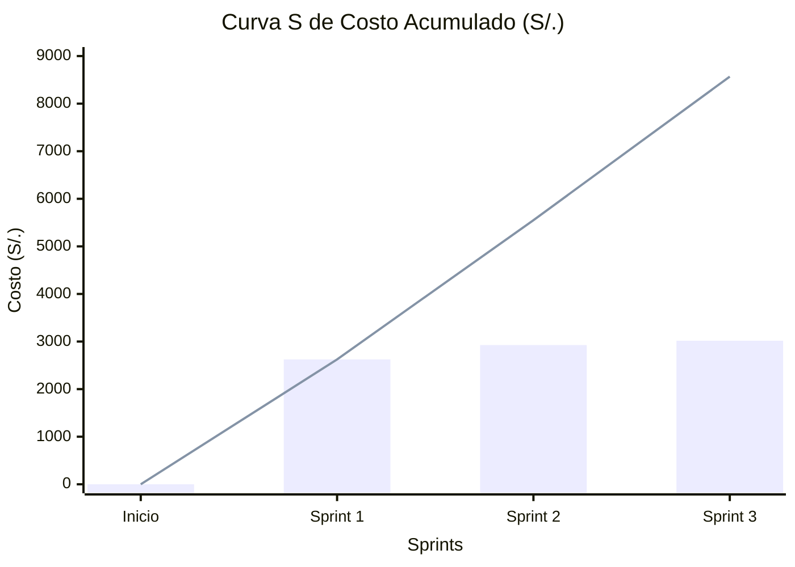

# Costo Acumulado del Proyecto

**Proyecto:** SGOHA  
**Distribución:** 3 Sprints (6 semanas)  

Este documento evidencia la evolución acumulativa de los gastos financieros del proyecto (Curva S).

---

## 1. Tabla de Costo Acumulado (S/.)

La tabla muestra la acumulación del gasto al final de cada sprint.

| Hito Temporal | Costo del Período (S/) | Costo Acumulado Total (S/) | % Consumido del Presupuesto |
|---|:---:|:---:|:---:|
| **Inicio del Proyecto** | 0 | **0** | 0.0% |
| **Fin del Sprint 1** | 2,625 | **2,625** | 30.6% |
| **Fin del Sprint 2** | 2,926 | **5,551** | 64.7% |
| **Fin del Sprint 3** | 3,017 | **8,568** | 100.0% |

---

## 2. Gráfico de Curva S (Burn-rate Financiero)

*(Leyenda: Las barras representan el gasto individual de cada sprint. La línea representa el costo acumulado o Curva S).*

---

## 3. Análisis del Burn-rate

1. **Alineación con el Presupuesto Base:** El proyecto no presenta desviaciones financieras entre lo planeado y lo ejecutado, cerrando exactamente en el presupuesto límite de S/. 8,568.
2. **Pendiente de la Curva:** La curva acumulada (línea) tiene una ligera aceleración (pendiente más pronunciada) entre el Sprint 2 y el Sprint 3. Esto es el comportamiento esperado y saludable para un proyecto de software, ya que las fases finales demandan más horas para pruebas de integración, resolución de bugs de UI y exportaciones, elevando el "Burn-rate" final.
