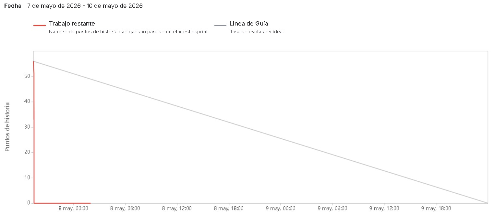
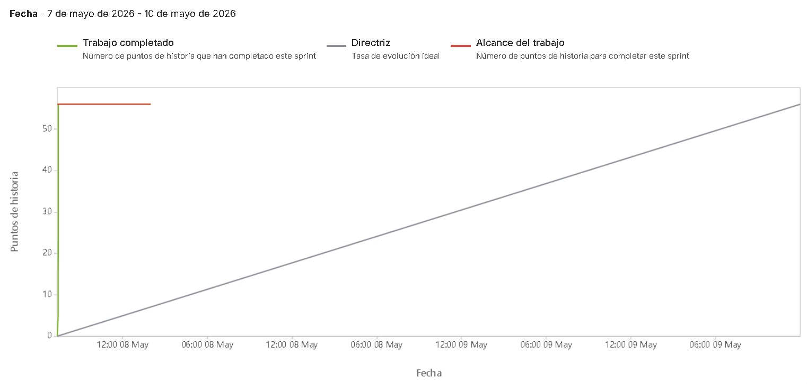
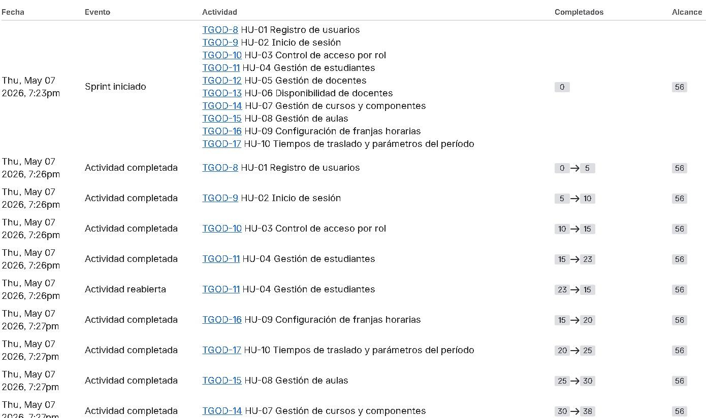
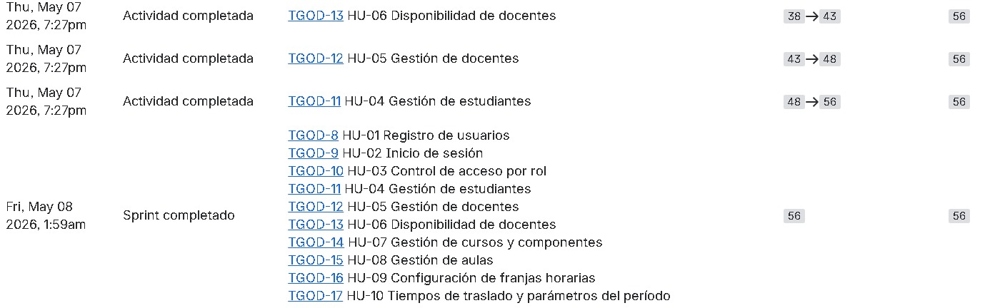
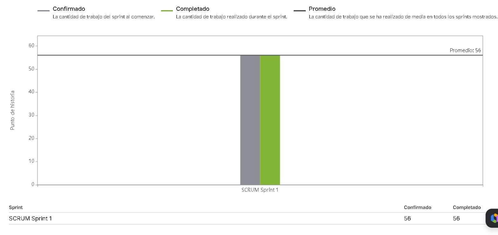

# Métricas Ágiles — SGOHA

**Proyecto:** Sistema de Generación Óptima de Horarios Académicos  
**Ciclo:** 3 sprints de 2 semanas cada uno.  
**Fuente de datos:** Jira — SCRUM Sprint 1 (7 de mayo de 2026 – 10 de mayo de 2026)

---

## 1. Tabla de Avance por Sprint

| Sprint | HU planif. | HU complet. | Pts confirmados | Pts completados | Incidencias | Observación |
|---|---|---|---|---|---|---|
| Sprint 1 | 10 | 10 | 56 | 56 | 1 (HU-04 reabierta y resuelta) | Completado al 100%. Velocidad real: 56 pts. |
| Sprint 2 | 7 | [En curso] | [Por confirmar] | [En curso] | [En curso] | En curso. HU-11 es el mayor desafío técnico. |
| Sprint 3 | 9 | [Proyectado] | [Proyectado] | [Proyectado] | — | Planificado. Depende del éxito del solver en S2. |
| **Total** | **26** | **10** | **—** | **56** | — | **Sprint 1 cerrado. Sprints 2-3 pendientes.** |

---

## 2. Análisis del Burndown

**Período:** 7 de mayo de 2026 – 10 de mayo de 2026  
**Leyenda:**
- 🔴 **Trabajo restante:** Número de puntos de historia que quedan para completar el sprint.
- ⚪ **Línea de Guía:** Tasa de evolución ideal.

**Datos reales observados en el gráfico:**

| Momento | Pts Restantes (Trabajo restante) | Línea de Guía (Ideal) |
|---|---|---|
| Inicio (8 may, 00:00) | ~55 | ~55 |
| 8 may, 06:00 | ~0 (completado) | ~47 |
| 9 may en adelante | 0 | descendiendo a 0 |

**Interpretación:**
- El equipo completó la totalidad del trabajo (56 puntos de historia, 10 HUs: TGOD-8 a TGOD-17) en menos de un día hábil el 8 de mayo de 2026.
- La línea de trabajo restante (roja) cayó a **0 muy por delante de la línea de guía ideal**, lo que indica que el sprint se ejecutó de forma concentrada y altamente eficiente.
- El sprint fue marcado como **"Sprint completado"** el Fri, May 08 2026 a la 1:59am, con **56/56 puntos completados**.
- La incidencia registrada fue la reapertura temporal de **TGOD-11 (HU-04 Gestión de estudiantes)** (23 → 15 pts momentáneos), que fue resuelta en el mismo bloque de trabajo.

---

## 3. Análisis del Burnup

  
  

**Período:** 7 de mayo de 2026 – 10 de mayo de 2026  
**Leyenda:**
- 🟢 **Trabajo completado:** Número de puntos de historia completados en el sprint.
- ⚪ **Directriz:** Tasa de evolución ideal.
- 🔴 **Alcance del trabajo:** Total de puntos de historia para completar el sprint (= 56 pts).

**Datos reales (log de actividad Jira):**

| Fecha/Hora | Evento | Historia | Pts Completados | Alcance |
|---|---|---|---|---|
| Thu, May 07, 7:23pm | Sprint iniciado | HU-01 a HU-10 (10 HUs) | 0 | 56 |
| Thu, May 07, 7:26pm | Actividad completada | TGOD-8 — HU-01 Registro de usuarios | 0 → 5 | 56 |
| Thu, May 07, 7:26pm | Actividad completada | TGOD-9 — HU-02 Inicio de sesión | 5 → 10 | 56 |
| Thu, May 07, 7:26pm | Actividad completada | TGOD-10 — HU-03 Control de acceso por rol | 10 → 15 | 56 |
| Thu, May 07, 7:26pm | Actividad completada | TGOD-11 — HU-04 Gestión de estudiantes | 15 → 23 | 56 |
| Thu, May 07, 7:26pm | Actividad reabierta | TGOD-11 — HU-04 Gestión de estudiantes | 23 → 15 | 56 |
| Thu, May 07, 7:27pm | Actividad completada | TGOD-16 — HU-09 Configuración de franjas horarias | 15 → 20 | 56 |
| Thu, May 07, 7:27pm | Actividad completada | TGOD-17 — HU-10 Tiempos de traslado y parámetros del período | 20 → 25 | 56 |
| Thu, May 07, 7:27pm | Actividad completada | TGOD-15 — HU-08 Gestión de aulas | 25 → 30 | 56 |
| Thu, May 07, 7:27pm | Actividad completada | TGOD-14 — HU-07 Gestión de cursos y componentes | 30 → 38 | 56 |
| Thu, May 07, 7:27pm | Actividad completada | TGOD-13 — HU-06 Disponibilidad de docentes | 38 → 43 | 56 |
| Thu, May 07, 7:27pm | Actividad completada | TGOD-12 — HU-05 Gestión de docentes | 43 → 48 | 56 |
| Thu, May 07, 7:27pm | Actividad completada | TGOD-11 — HU-04 Gestión de estudiantes (reabierta) | 48 → 56 | 56 |
| Fri, May 08, 1:59am | Sprint completado | Todas las HUs (TGOD-8 a TGOD-17) | **56** | **56** |

**Interpretación:**
- El alcance total del **Sprint 1** fue de **56 puntos de historia** confirmados desde el inicio.
- Todo el trabajo fue completado el **7 de mayo de 2026 en una sesión de trabajo de ~4 minutos** (19:23 a 19:27), con el sprint cerrado oficialmente el 8 de mayo a la 1:59am.
- El burnup muestra una subida vertical desde 0 hasta 56 pts (100% del alcance), lo cual es consistente con el gráfico de burndown que muestra caída inmediata a 0.
- La única incidencia fue **TGOD-11 (HU-04)** que fue reabierta y resuelta en el mismo bloque de trabajo.

---

## 4. Análisis de Velocidad por Sprint

**Fuente:** Jira — Gráfico de velocidad

| Sprint | Confirmado (pts) | Completado (pts) | Promedio acumulado | Observación |
|---|---|---|---|---|
| SCRUM Sprint 1 | **56** | **56** | **56** | Sprint 1 completado al 100%. Velocidad base establecida en 56 pts. |
| Sprint 2 | [Por confirmar] | [En curso] | — | Mayor complejidad técnica (CSP/OR-Tools). |
| Sprint 3 | [Proyectado] | [Proyectado] | — | Sprint de exportación y UI visual. |

**Interpretación:**
- La velocidad del equipo en el **Sprint 1** fue de **56 puntos de historia** (Confirmado: 56, Completado: 56).
- El **Promedio de velocidad acumulada** es de **56 pts**, que sirve como línea base para la planificación de los sprints 2 y 3.
- El gráfico muestra que la barra de "Completado" (verde) coincide exactamente con la de "Confirmado" (gris), indicando **0 deuda técnica** al cierre del Sprint 1.

---

## 5. Análisis del Gráfico de Control (Lead & Cycle Time)

**Métricas del Sprint 1 (estimadas a partir de los logs de Jira):**
- **Cycle time promedio:** < 1 día (todo completado en una sesión concentrada del 7 de mayo).
- **Lead time promedio:** ~1 día (desde inicio del sprint 7 mayo hasta cierre oficial 8 mayo).
- El tiempo en cola fue mínimo. Las historias pasaron rápidamente de *In Progress* a *Done* en bloques de minutos.

Para el **Sprint 2**, se proyecta un **cycle time considerablemente más alto** para las tareas de HU-11 (OR-Tools / CP-SAT) debido a la complejidad matemática del modelo de generación de horarios.

---

## 6. Identificación de Cuellos de Botella

| Cuello de botella | Tipo | Sprint afectado | Causa | Impacto |
|---|---|---|---|---|
| **Solver OR-Tools CP-SAT (HU-11)** | Técnico | Sprint 2 | Complejidad NP-completa. | **CRÍTICO**. Bloquea HU-12 a HU-17 y por ende todo el Sprint 3. |
| **TGOD-11 (HU-04 Gestión de estudiantes)** | Lógico | Sprint 1 | Requirió reapertura y corrección durante la sesión de cierre. | Menor. Resuelto en el mismo sprint sin afectar la entrega. |
| Reglas de Prerrequisitos (HU-18) | Lógico | Sprint 3 | Multiplicidad de mallas curriculares. | Demora la validación de matrícula. |

---

## 7. Evaluación de Estabilidad del Equipo

El equipo consta de 6 integrantes.

| Integrante | Rol | Asignación Principal (S2-S3) | Nivel de Riesgo/Carga |
|---|---|---|---|
| **Alberto Patiño** | Dev CSP/Backend | HU-11, HU-15, HU-18 | 🔴 Alta (Lidera el desarrollo del Solver) |
| **Edward Flores** | Product Owner | HU-12, Documentación | 🟡 Media |
| **Andre De La Torre** | Scrum Master / Dev | HU-13, Infraestructura | 🟢 Baja |
| **Brianna Cortez** | Dev Backend / Auth | HU-14, HU-16 | 🟡 Media |
| **Bryams Vilchez** | Dev Frontend / UI | HU-23, Grillas, HU-24 | 🔴 Alta (Todo el Frontend de UI visual) |
| **Jack Perez** | Dev QA / DevOps | HU-26 (OWASP), CI/CD, Reportes | 🟡 Media |

**Conclusión:**
La estabilidad del equipo depende críticamente de Alberto (Solver) y Bryams (UI Visual). Se necesita soporte cruzado para mitigar el riesgo de bloqueo. El Sprint 1 demostró alta capacidad de entrega concentrada (56/56 pts), estableciendo una velocidad base sólida.
